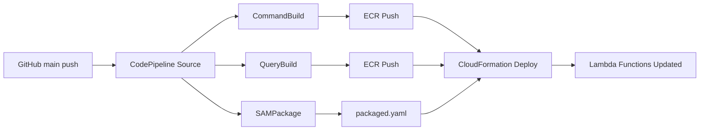

# CLAUDE.md

このファイルは、このリポジトリでコードを扱う際のClaude Code（claude.ai/code）へのガイダンスを提供します。

## プロジェクト概要

これは、SwiftとVaporで構築されたCQRS（コマンドクエリ責任分離）とイベントソーシングのサンプルアプリケーションです。このプロジェクトは、SAM（サーバーレスアプリケーションモデル）を使用してAWS
Lambdaにデプロイされるように設計された、独立したコマンドサーバーとクエリサーバーを持つマイクロサービスアーキテクチャを実証しています。

## アーキテクチャ

プロジェクトはCQRS/ES原則に従っています：

- **コマンドサーバー** (`Sources/Command/Server/`): 書き込み操作を処理し、REST APIのためのOpenAPI仕様を使用し、OpenTelemetryによる分散トレーシングを含みます
- **クエリサーバー** (`Sources/Query/Server/`): 読み取り操作を処理し、Fluent経由でPostgreSQLデータベース統合を含みます
- **独立したデプロイメント**: 各サーバーはAPI Gatewayの背後で独立したLambda関数として実行されます

## 規則

- コード変更時には、影響箇所に応じて以下がパスする必要があります。
  - `swift format lint -r .` (/claude/workspace/Server) 
  - `swift build` (/claude/workspace/Server)
  - `swift test` (/claude/workspace/Server)
  - `tofu fmt` (/claude/workspace/Server/AWS)
  - `sam validate --lint` (/claude/workspace/Server)
  - `openapi-generator validate -i ./Server/Sources/Command/Server/openapi.yaml` (/claude/workspace)

## 環境

### コンテナ

この環境はコンテナ内にあり、ARM64 Ubuntu noble上での開発環境です。
コンテナ内ではありますが、dockerはrootlessで使用可能です

### Git

- pushすることはできませんが、commitすることは可能です。
- しかし、原則指示されていない場合に無断でcommitすることは許されていません。
- ghコマンドあるいはGitHub MCPを使用してGitHubを閲覧・操作することが可能です。

### Swift

- Swift 6.1を使用可能です。
- Vaporコマンドも利用可能です。

### AWS

- Terraformの代替としてOpenTofu(`tofu`)が使用可能です。
- AWS SAM CLIも使用可能です。
- TerraformやAWSのMCPを利用してドキュメントを閲覧可能です。

### X-Ray OTLP APIの要件

- AWS X-RayのOTLP APIを使用する場合、CloudWatch LogsをトレースデスティネーションとしてUpdateTraceSegmentDestination APIで有効化する必要があります
- SAMテンプレートでカスタムリソースとしてこの設定を管理しています（本来はリージョンレベルの設定のため、Terraformで管理することも検討可能）
- エラー例: `The OTLP API is supported with CloudWatch Logs as a Trace Segment Destination.` (400 InvalidRequestException)

### TerraformとSAMの役割分担

**Terraform（AWS/main.tf）**
- Application Signals Discovery（アカウントレベルの設定）
- ECRリポジトリの管理
- CI/CDパイプライン（CodePipeline、CodeBuild）
- IAMロール（super_role）

**SAM（template.yaml）**
- Lambda関数の定義と設定
- API Gateway（HttpApi）
- 環境変数（OTEL関連）
- IAM権限（関数実行ロール）
- UpdateTraceSegmentDestination（リージョンレベル設定だが、OTLPの必須設定のためここで管理）

### Lambda関数の環境変数設定

```yaml
Environment:
  Variables:
    # X-Ray設定
    AWS_XRAY_CONTEXT_MISSING: LOG_ERROR  # コンテキスト欠落時にエラーログのみ（クラッシュ防止）
    # OpenTelemetry設定
    OTEL_EXPORTER_OTLP_ENDPOINT: !Sub https://xray.${AWS::Region}.amazonaws.com
    OTEL_PROPAGATORS: xray  # X-RayトレースIDフォーマットを使用
    OTEL_METRICS_EXPORTER: none  # メトリクスエクスポートを無効化（トレースのみ）
    OTEL_AWS_APPLICATION_SIGNALS_ENABLED: true  # Application Signals有効化
    OTEL_RESOURCE_ATTRIBUTES: service.name=CommandServer  # サービス名（必須）
```

### IAM権限の設定

- `AWSXRayDaemonWriteAccess`マネージドポリシー（以下を含む）：
  - xray:PutTraceSegments
  - xray:PutTelemetryRecords
  - xray:GetSamplingRules
  - xray:GetSamplingTargets
  - xray:GetSamplingStatisticSummaries
- 追加権限：
  - cloudwatch:PutMetricData（Application Signalsのメトリクス送信用）

### CI/CDパイプライン

**注意: GitHub Actionsは使用されておらず、AWS CodePipelineがCDを担当しています。**

#### パイプラインの流れ

1. **Source Stage**: 
   - GitHubの`main`ブランチを監視（CodeStar Connection経由）
   - リポジトリ: `lemo-nade-room/cqrs-es-example-swift`
   - pushされると自動的にパイプラインが起動

2. **Build Stage** (並列実行):
   - **CommandBuild**: 
     - Dockerfile: `Server/Sources/Command/Dockerfile`
     - DockerイメージをビルドしてECRにプッシュ
   - **QueryBuild**: 
     - Dockerfile: `Server/Sources/Query/Dockerfile`
     - DockerイメージをビルドしてECRにプッシュ
   - **SAMPackage**: 
     - `sam package`を実行して`packaged.yaml`を生成

3. **Deploy Stage**:
   - CloudFormationを使用して`Stage`スタックをデプロイ
   - Lambda関数のDockerイメージを更新
   - API GatewayやIAMロールなども同時に更新

#### インフラ構成 (`Server/AWS/`)

- **ECRリポジトリ**:
  - `command-server-function`: コマンドサーバー用
  - `query-server-function`: クエリサーバー用
  - タグなしイメージは1日後に自動削除

- **CodeBuildプロジェクト**:
  - `docker_build_and_push`: DockerイメージのビルドとECRへのプッシュ
  - `sam_package`: SAMテンプレートのパッケージング
  - ARM64アーキテクチャを使用

- **IAMロール**:
  - `super_role`: PowerUserAccess + IAMFullAccess権限
  - CodeBuild, CodePipeline, CloudFormation, Lambdaが使用

#### デプロイフロー



#### mainブランチへのpush時の動作

**✅ 現在の実装はmainブランチにpushすると自動デプロイされます。**

ただし、以下の点に注意：

1. **ビルド時間**: Dockerイメージのビルドに約15分程度かかります
2. **ビルド失敗の可能性**: 
   - Swiftパッケージの依存関係解決エラー
   - Dockerイメージサイズの問題
3. **ロールバック**: CloudFormationの`REPLACE_ON_FAILURE`設定により、失敗時は自動ロールバック

#### デプロイ前の確認事項

- [ ] `swift build`が成功するか
- [ ] `swift test`が成功するか
- [ ] Dockerfileが正しくビルドできるか
- [ ] SAMテンプレートが正しいか（`sam validate --lint`）

#### 現在のステータス（2025年1月時点）

- **ビルド状態**: ✅ 正常
- **テスト**: ✅ パス
- **SAM検証**: ✅ 有効
- **X-Rayトレース**: ✅ 実装完了（OTLP/HTTP + SigV4認証）
- **mainブランチpush**: ✅ 安全（自動デプロイされます）

詳細は`AWS_CD_STATUS.md`を参照してください。

### Docker

- Docker Compose v2が利用可能です（`docker compose`コマンド）
- `docker-compose-v2`パッケージはaptでインストール可能です
- Docker in Docker環境のため、ホストのlocalhostにアクセスできない場合があります
  - Dockerコンテナ間の通信にはDockerネットワークのIPアドレスを使用する必要があります
  - 例：Jaegerコンテナへの接続時は`localhost:4318`ではなく、コンテナのIPアドレスを使用

### OpenTelemetry

- CommandServerにOpenTelemetry Swift（1.0.0以降）が統合されています
- VaporのAsyncMiddlewareとしてOpenTelemetryTracingMiddlewareが実装されています
- トレーシングデータはOTLP/HTTP経由でJaegerまたはAWS X-Rayに送信されます
- ローカル開発環境では、Jaeger All-in-Oneをdocker composeで起動できます：
  - Jaeger UI: http://localhost:16686
  - OTLP HTTP Receiver: port 4318
- 環境変数`OTEL_EXPORTER_OTLP_ENDPOINT`でエクスポート先を設定可能です
- X-Rayトレースコンテキストの伝播をサポート（`x-amzn-trace-id`ヘッダー）
- Lambda環境での動作：
  - `AWS_LAMBDA_FUNCTION_NAME`環境変数で自動検出
  - AWS Lambda Container Imagesの制約：
    - Lambda LayersはContainer Imageタイプでは使用不可
    - ADOT Lambda Layerが使えないため、アプリケーション内でOTLP送信を実装
  - CloudWatch Application SignalsのOTLPエンドポイント（`https://xray.{region}.amazonaws.com/v1/traces`）を使用
  - SigV4認証を実装済み：
    - `AWSSigV4.swift`: 最小限のSigV4署名実装（swift-cryptoを使用）
    - `AWSXRayOTLPExporter.swift`: X-Ray用のOTLPエクスポーター（SigV4認証付き、AsyncHTTPClient使用）
    - Lambda環境でのみトレースデータを送信（ローカルではスキップ）
    - Fire-and-forget方式の非同期送信で、レスポンスを待たずに即座に成功を返す
    - Sendable制約に対応するため、早期にProtobufシリアライズを実行

### 依存関係の注意点

- OpenTelemetry Swiftパッケージの構造：
  - `OpenTelemetryProtocolExporterHTTP`プロダクトは実験的で、HTTPエクスポーターの実装が不完全
  - `StdoutExporter`プロダクトを使用してローカルデバッグが可能
  - `OpenTelemetryProtocolExporterCommon`にProtobuf定義があり、独自のHTTPエクスポーター実装に使用
  - swift-otel（別プロジェクト）も検討したが、HTTPエクスポーターがないため現時点では採用せず
- AWS SDK for Swift（`aws-sdk-swift`）：
  - smithy-swiftとの依存関係競合のため使用を断念
  - SigV4認証は独自実装（`AWSSigV4.swift`）
- HTTPクライアント：
  - Lambda環境ではURLSessionが使用できないため、AsyncHTTPClientを使用
  - VaporのApplication.eventLoopGroupを共有することで、リソースを効率的に使用
  - eventLoopGroupProviderは`.shared(eventLoopGroup)`を使用
- swift-crypto：
  - SigV4署名のためのSHA256およびHMAC実装に使用
  - Appleの公式パッケージで安定している
- Swift 6の並行性：
  - `SpanData`などがSendableでないため、Task.detachedでの送信時は早期にシリアライズ
  - `@unchecked Sendable`と`@preconcurrency`を使用して移行対応

### Lambda関数の設定

- **タイムアウト**: 10秒（デフォルト3秒ではコールドスタート時にタイムアウトする）
- **メモリ**: 128MB（デフォルト）
- **アーキテクチャ**: ARM64
- **ログレベル**: DEBUG（LOG_LEVEL環境変数で制御）

## OpenTelemetry実装の注意点

### Application Signalsの有効化
- CloudWatch Application Signalsの有効化にはAWS CC (Cloud Control) プロバイダーを使用
- `awscc_applicationsignals_discovery`リソースで自動的にサービスリンクロールが作成される
- CloudFormationの混在を避けるため、Terraformのみで実装可能

### リソース属性の設定
- Application Signalsでトレースを表示するには、`service.name`などのリソース属性が必須
- AWSXRayOTLPExporterで`ResourceSpans`にリソース情報を含める必要がある
- 環境変数`OTEL_RESOURCE_ATTRIBUTES`から属性を読み込む実装が重要

### AttributeValueのProtobuf変換
- OpenTelemetryのAttributeValue型をProtobufに変換する際の注意点：
  - `.array(AttributeArray)`の場合は`.values`プロパティにアクセス
  - `.set(AttributeSet)`の場合は`.labels.values`で値の配列を取得
  - deprecated caseも含めてすべてのケースを処理する必要がある

### HTTPClientResponseのボディ読み取り
- AsyncHTTPClientのレスポンスボディは非同期で読み取る必要がある：
  ```swift
  let bodyData = try await response.body.collect(upTo: 1024 * 1024)
  let responseString = bodyData.getString(at: 0, length: bodyData.readableBytes)
  ```
- `response.body`は`HTTPClientResponse.Body`型で、直接`readData`メソッドは存在しない
- `collect(upTo:)`メソッドでバイト制限を設定して読み取る

### AWS SigV4署名でのHostヘッダー
- AWS SigV4署名では、`Host`ヘッダーは必須の署名対象ヘッダー
- AsyncHTTPClientを使用する場合、明示的にHostヘッダーを追加する必要がある：
  ```swift
  if let host = URL(string: request.url)?.host {
      request.headers.add(name: "Host", value: host)
  }
  ```
- エラー例: `'Host' or ':authority' must be a 'SignedHeader' in the AWS Authorization.` (403 InvalidSignatureException)

### デバッグログのベストプラクティス

#### 絵文字の使い方
効果的に絵文字を使って視覚的に分かりやすくする：
- 🚀 起動・開始
- ✅ 成功
- ❌ エラー・失敗
- ⚠️ 警告
- 🔧 設定・構成
- 📦 パッケージ・バッチ処理
- 📡 ネットワーク通信・エンドポイント
- 🔗 接続・リンク
- 📍 場所・ロケーション
- 🏷️ ラベル・タグ
- 🌐 環境・グローバル
- 🏥 ヘルスチェック
- 🎉 完了・成功
- 🧩 コンポーネント・モジュール
- 🏗️ ビルド・初期化
- 🔐 認証・セキュリティ

#### ログレベルとプレフィックス
- `logger.debug()`使用時は`[DEBUG]`プレフィックス不要（冗長になる）
- `print()`使用時のみ必要に応じてプレフィックスを使用

#### ログの簡潔性
- 初期化時：1行で要約（例：`🏗️ Initializing AWSXRayOTLPExporter | Region: ap-northeast-1`）
- 設定完了時：1行で要約（例：`✅ OpenTelemetry ready with service: Stage-CommandServerFunction`）
- エラー時のみ詳細を出力

#### 情報の集約
- 複数の関連情報は1行にまとめる
  ```swift
  app.logger.debug("🌐 Environment: \(app.environment) | Lambda: ✅ | Function: \(functionName)")
  app.logger.debug("📍 Region: \(region) | Memory: \(memorySize)MB")
  ```

#### セクション区切りの最小化
- 重要なセクションのみ区切りを使用
- 通常の処理フローでは区切り不要
- エラー解析が必要な部分でのみ詳細ログ

#### Fire-and-forgetパターン
- 非同期タスクの結果は簡潔に
  ```swift
  print("✅ Exported \(spanCount) spans to X-Ray")  // 成功時
  print("❌ X-Ray export failed: \(error)")          // 失敗時
  ```

### Swift Formatの注意点

- `case let`パターンは使用せず、`case .enum(let value)`の形式を使用する
  ```swift
  // ❌ Bad
  case let .string(value):
  
  // ✅ Good  
  case .string(let value):
  ```


