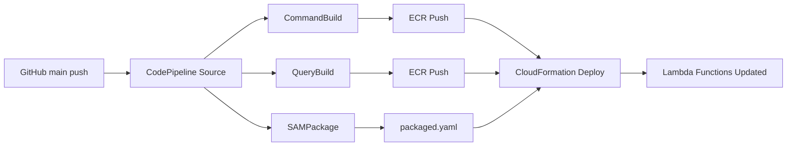

# CLAUDE.md

このファイルは、このリポジトリでコードを扱う際のClaude Code（claude.ai/code）へのガイダンスを提供します。

## プロジェクト概要

これは、SwiftとVaporで構築されたCQRS（コマンドクエリ責任分離）とイベントソーシングのサンプルアプリケーションです。このプロジェクトは、SAM（サーバーレスアプリケーションモデル）を使用してAWS
Lambdaにデプロイされるように設計された、独立したコマンドサーバーとクエリサーバーを持つマイクロサービスアーキテクチャを実証しています。

## アーキテクチャ

プロジェクトはCQRS/ES原則に従っています：

- **コマンドサーバー** (`Sources/Command/Server/`): 書き込み操作を処理し、REST APIのためのOpenAPI仕様を使用し、OpenTelemetryによる分散トレーシングを含みます
- **クエリサーバー** (`Sources/Query/Server/`): 読み取り操作を処理し、Fluent経由でPostgreSQLデータベース統合を含みます
- **独立したデプロイメント**: 各サーバーはAPI Gatewayの背後で独立したLambda関数として実行されます

## 規則

- コード変更時には、影響箇所に応じて以下がパスする必要があります。
  - `swift format lint -r .` (/claude/workspace/Server) 
  - `swift build` (/claude/workspace/Server)
  - `swift test` (/claude/workspace/Server)
  - `tofu fmt` (/claude/workspace/Server/AWS)
  - `sam validate --lint` (/claude/workspace/Server)
  - `openapi-generator validate -i ./Server/Sources/Command/Server/openapi.yaml` (/claude/workspace)

## 環境

### コンテナ

この環境はコンテナ内にあり、ARM64 Ubuntu noble上での開発環境です。
コンテナ内ではありますが、dockerはrootlessで使用可能です

### Git

- pushすることはできませんが、commitすることは可能です。
- しかし、原則指示されていない場合に無断でcommitすることは許されていません。
- ghコマンドあるいはGitHub MCPを使用してGitHubを閲覧・操作することが可能です。

### Swift

- Swift 6.1を使用可能です。
- Vaporコマンドも利用可能です。

### AWS

- Terraformの代替としてOpenTofu(`tofu`)が使用可能です。
- AWS SAM CLIも使用可能です。
- TerraformやAWSのMCPを利用してドキュメントを閲覧可能です。

### CI/CDパイプライン

**注意: GitHub Actionsは使用されておらず、AWS CodePipelineがCDを担当しています。**

#### パイプラインの流れ

1. **Source Stage**: 
   - GitHubの`main`ブランチを監視（CodeStar Connection経由）
   - リポジトリ: `lemo-nade-room/cqrs-es-example-swift`
   - pushされると自動的にパイプラインが起動

2. **Build Stage** (並列実行):
   - **CommandBuild**: 
     - Dockerfile: `Server/Sources/Command/Dockerfile`
     - DockerイメージをビルドしてECRにプッシュ
   - **QueryBuild**: 
     - Dockerfile: `Server/Sources/Query/Dockerfile`
     - DockerイメージをビルドしてECRにプッシュ
   - **SAMPackage**: 
     - `sam package`を実行して`packaged.yaml`を生成

3. **Deploy Stage**:
   - CloudFormationを使用して`Stage`スタックをデプロイ
   - Lambda関数のDockerイメージを更新
   - API GatewayやIAMロールなども同時に更新

#### インフラ構成 (`Server/AWS/`)

- **ECRリポジトリ**:
  - `command-server-function`: コマンドサーバー用
  - `query-server-function`: クエリサーバー用
  - タグなしイメージは1日後に自動削除

- **CodeBuildプロジェクト**:
  - `docker_build_and_push`: DockerイメージのビルドとECRへのプッシュ
  - `sam_package`: SAMテンプレートのパッケージング
  - ARM64アーキテクチャを使用

- **IAMロール**:
  - `super_role`: PowerUserAccess + IAMFullAccess権限
  - CodeBuild, CodePipeline, CloudFormation, Lambdaが使用

#### デプロイフロー

#### mainブランチへのpush時の動作

**✅ 現在の実装はmainブランチにpushすると自動デプロイされます。**

ただし、以下の点に注意：

1. **ビルド時間**: Dockerイメージのビルドに約15分程度かかります
2. **ビルド失敗の可能性**: 
   - Swiftパッケージの依存関係解決エラー
   - Dockerイメージサイズの問題
3. **ロールバック**: CloudFormationの`REPLACE_ON_FAILURE`設定により、失敗時は自動ロールバック

#### デプロイ前の確認事項

- [ ] `swift build`が成功するか
- [ ] `swift test`が成功するか
- [ ] Dockerfileが正しくビルドできるか
- [ ] SAMテンプレートが正しいか（`sam validate --lint`）

#### 現在のステータス（2025年1月時点）

- **ビルド状態**: ✅ 正常（警告1件: 未使用のaws-sdk-swift依存関係）
- **テスト**: ✅ パス
- **SAM検証**: ✅ 有効
- **X-Rayトレース**: ⚠️ 送信部分はコメントアウト（SigV4認証は実装済み）
- **mainブランチpush**: ✅ 安全（自動デプロイされます）

詳細は`AWS_CD_STATUS.md`を参照してください。

### Docker

- Docker Compose v2が利用可能です（`docker compose`コマンド）
- `docker-compose-v2`パッケージはaptでインストール可能です
- Docker in Docker環境のため、ホストのlocalhostにアクセスできない場合があります
  - Dockerコンテナ間の通信にはDockerネットワークのIPアドレスを使用する必要があります
  - 例：Jaegerコンテナへの接続時は`localhost:4318`ではなく、コンテナのIPアドレスを使用

### OpenTelemetry

- CommandServerにOpenTelemetry Swift（1.0.0以降）が統合されています
- VaporのAsyncMiddlewareとしてOpenTelemetryTracingMiddlewareが実装されています
- トレーシングデータはOTLP/HTTP経由でJaegerまたはAWS X-Rayに送信されます
- ローカル開発環境では、Jaeger All-in-Oneをdocker composeで起動できます：
  - Jaeger UI: http://localhost:16686
  - OTLP HTTP Receiver: port 4318
- 環境変数`OTEL_EXPORTER_OTLP_ENDPOINT`でエクスポート先を設定可能です
- X-Rayトレースコンテキストの伝播をサポート（`x-amzn-trace-id`ヘッダー）
- Lambda環境での動作：
  - `AWS_LAMBDA_FUNCTION_NAME`環境変数で自動検出
  - AWS Lambda Container Imagesの制約：
    - Lambda LayersはContainer Imageタイプでは使用不可
    - ADOT Lambda Layerが使えないため、アプリケーション内でOTLP送信を実装
  - CloudWatch Application SignalsのOTLPエンドポイント（`https://xray.{region}.amazonaws.com`）を使用
  - SigV4認証を実装済み：
    - `AWSSigV4.swift`: 最小限のSigV4署名実装（swift-cryptoを使用）
    - `AWSXRayOTLPExporter.swift`: X-Ray用のOTLPエクスポーター（SigV4認証付き）
    - Lambda環境でのみトレースデータを送信（ローカルではスキップ）
    - 現在は同期的な実装のため、実際のHTTP送信部分はコメントアウト中

### 依存関係の注意点

- OpenTelemetry Swiftパッケージの構造：
  - `OpenTelemetryProtocolExporterHTTP`プロダクトはあるが、内部モジュールは直接使用不可
  - `StdoutExporter`プロダクトを使用してローカルデバッグが可能
  - OTLP HTTPエクスポーターの実装には`OpenTelemetryProtocolExporterCommon`が必要だが、プロダクトとして公開されていない
- AWS SDK for Swift（`aws-sdk-swift`）：
  - バージョン指定は`from: "1.0.0"`を使用（`exact`は避ける）
  - AWS SDKとsmithy-swiftの依存関係の問題：
    - aws-sdk-swiftは内部的にsmithy-swiftを含むが、そのモジュールは公開されていない
    - smithy-swiftを別途追加するとバージョン競合が発生
    - SigV4認証のために独自実装が必要
- HTTPクライアント：
  - URLSessionは使用できないため、AsyncHTTPClientを使用
  - VaporのApplication.eventLoopGroupを共有することで、リソースを効率的に使用
  - eventLoopGroupProviderは`.shared(eventLoopGroup)`を使用
- swift-crypto：
  - SigV4署名のためのSHA256およびHMAC実装に使用
  - Appleの公式パッケージで安定している

